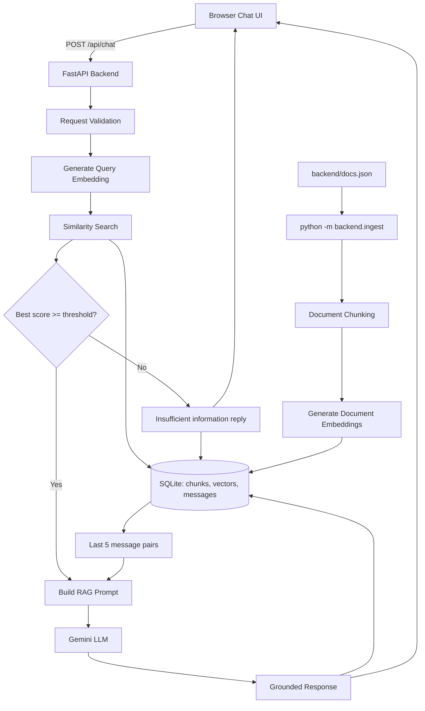
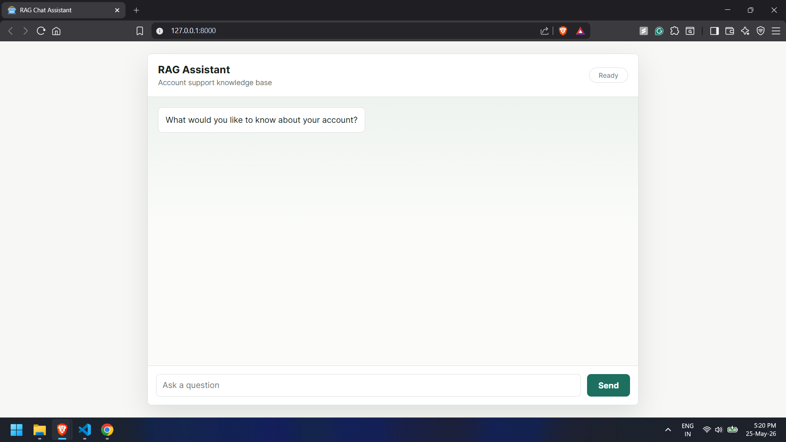
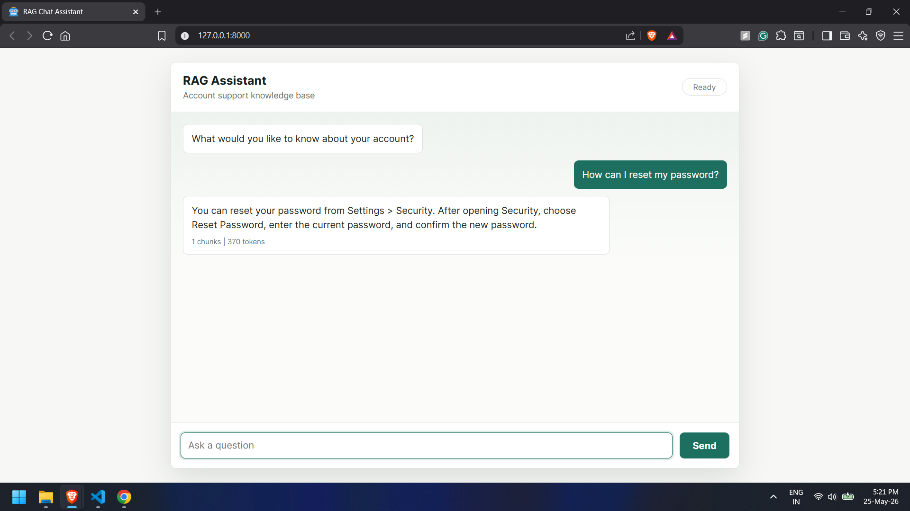
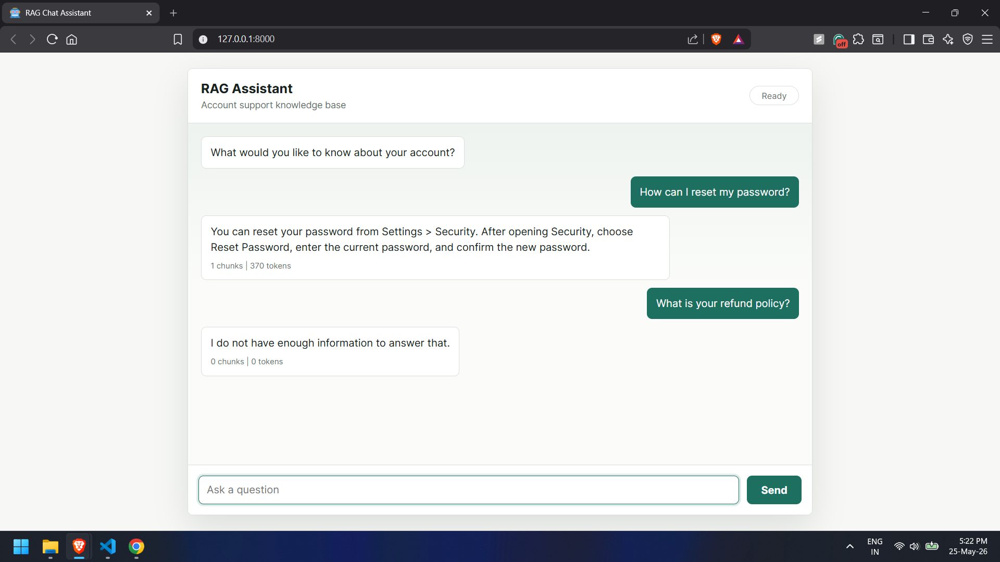

# GenAI Assistant with RAG

A FastAPI + SQLite Retrieval Augmented Generation Chat Assistant using Gemini for embeddings and answer generation. The assistant answers only from the local knowledge base in `backend/docs.json`, stores embeddings in SQLite, retrieves the most relevant chunks with cosine similarity, and keeps short session-based chat history.

## Architecture Diagram



## RAG Workflow Explanation

The app separates indexing from answering:

1. `backend/docs.json` contains the knowledge base documents.
2. `python -m backend.ingest` loads documents, splits them into chunks, generates embeddings with Gemini, and stores each chunk and vector in SQLite.
3. When a user asks a question, `/api/chat` validates `sessionId` and `message`.
4. The question is converted into a query embedding.
5. The backend compares the query vector with stored document vectors.
6. The top matching chunks are selected only if they pass the similarity threshold.
7. The retrieved context, recent conversation history, and current question are combined into a prompt.
8. Gemini generates the final response using only the provided context.
9. The user and assistant messages are saved for follow-up questions.

If retrieval confidence is too low, the app returns:

```text
I do not have enough information to answer that.
```

## Embedding Strategy

The project uses Gemini embeddings through the `google-genai` SDK. The default embedding model is configured as:

```env
EMBEDDING_MODEL=gemini-embedding-2
```

Documents and questions are formatted differently before embedding:

- Document chunks include the source title: `title: Reset Password | text: ...`
- User questions include the retrieval task: `task: question answering | query: ...`

This keeps document vectors and query vectors aligned for question-answer retrieval while preserving source context for ranking and prompt construction.

Chunking is deterministic and word-based. Each document is split into chunks targeting 300-500 tokens, with a small overlap so important context near chunk boundaries is not lost.

## Similarity Search Logic

Similarity search is implemented in `backend/retrieval.py` with cosine similarity:

```text
cosine_similarity = dot(query, chunk) / (norm(query) * norm(chunk))
```

Retrieval behavior:

- Compare the query embedding against every stored chunk embedding.
- Sort chunks by similarity score descending.
- Select the top `TOP_K` chunks, default `3`.
- Reject the retrieval result if the best score is below `SIMILARITY_THRESHOLD`, default `0.75`.
- Include only chunks that pass the threshold in the final prompt.

This prevents unrelated documents from being sent to the LLM and reduces hallucinated answers.

## Prompt Design Reasoning

The prompt is designed to make grounding explicit:

- It tells the model to answer only from the provided context.
- It includes retrieved chunks with titles and similarity scores.
- It includes the last 5 message pairs so follow-up questions can refer to earlier turns.
- It includes the current user question at the end.
- It instructs the model to return the exact insufficient-information sentence when the answer is not present.

The LLM temperature defaults to `0.2` so responses are more consistent and factual for support-style answers.

## Setup Instructions

1. Create and activate a Python 3.10+ virtual environment.

2. Install dependencies:

   ```powershell
   pip install -r requirements.txt
   ```

3. Create `.env` from `.env.example` and add your Gemini API key:

   ```env
   LLM_API_KEY=your_gemini_api_key
   EMBEDDING_API_KEY=your_gemini_api_key
   LLM_MODEL=gemini-2.5-flash
   EMBEDDING_MODEL=gemini-embedding-2
   DATABASE_PATH=./rag.sqlite3
   SIMILARITY_THRESHOLD=0.75
   TOP_K=3
   ```

4. Build the SQLite vector index:

   ```powershell
   python -m backend.ingest
   ```

5. Run the app:

   ```powershell
   uvicorn backend.main:app --reload
   ```

6. Open the frontend:

   ```text
   http://127.0.0.1:8000
   ```

## API

### `GET /health`

Returns service health, the SQLite database path, and the number of indexed chunks.

### `POST /api/chat`

Request:

```json
{
  "sessionId": "abc123",
  "message": "How can I reset my password?"
}
```

Response:

```json
{
  "reply": "Users can reset their password from Settings > Security.",
  "tokensUsed": 120,
  "retrievedChunks": 3
}
```

Validation errors are returned for missing `sessionId`, empty `message`, or invalid JSON. Provider failures are mapped to JSON errors for invalid API key, timeout, and rate limit cases.

## Knowledge Base

Seed documents live in `backend/docs.json`. After editing the knowledge base, rerun:

```powershell
python -m backend.ingest
```

## Tests

Run the test suite:

```powershell
pytest
```

The tests cover chunking, storage, cosine ranking, threshold rejection, prompt construction, chat history trimming, and API response validation.

## Screenshots

<<<<<<< HEAD



=======
```md


```
>>>>>>> fe7d32f05cf6eb4019a1b7bc0e3bbc688ac8bc6b
